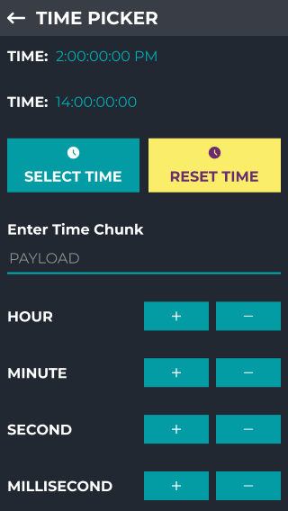

# DateTimeApp

DateTimeApp is a comprehensive utility application designed to assist users with various date and time-related tasks. It includes key features like date selection, time picking, timestamp manipulation, and time conversions.

## Features

DateTimeApp includes the following functionalities:

1. **Date Picker Activity**: Allows users to select a date through a calendar interface.
2. **TimePicker Activity**: Provides an intuitive time picker for selecting time.
3. **Timestamp Activity**: Generates a timestamp for the current or a specific time.
4. **Timestamp to Date**: Converts any timestamp into a human-readable date format.
5. **Timestamp to Time**: Converts a timestamp into a specific time format.
6. **Date Diff in Hours**: Calculates the difference in hours between two dates.
7. **TimeDiff in Seconds**: Finds the difference in seconds between two times.
8. **Time Converter**: Facilitates the conversion between various time units (minutes, hours, etc.).

## Requirements

- Kotlin Compiler: To build and run this app, your development environment must have the Kotlin compiler installed. This ensures that the Kotlin code is properly compiled into executable bytecode for the Android platform.

### 1. Date Picker Activity
Utilizes a calendar interface to allow users to easily select a date.

### 2. TimePicker Activity
Offers an intuitive picker for users to select a specific time.

### 3. Timestamp Activity
Generates timestamps for the current or a user-specified time.

### 4. Timestamp to Date
Converts timestamps into a human-readable date format.

### 5. Timestamp to Time
Transforms timestamps into a specific time format.

### 6. Date Diff in Hours
Calculates the difference in hours between two selected dates.

### 7. TimeDiff in Seconds
Determines the difference in seconds between two specific times.

### 8. Time Converter
Allows for conversion between different units of time, such as minutes to hours.

